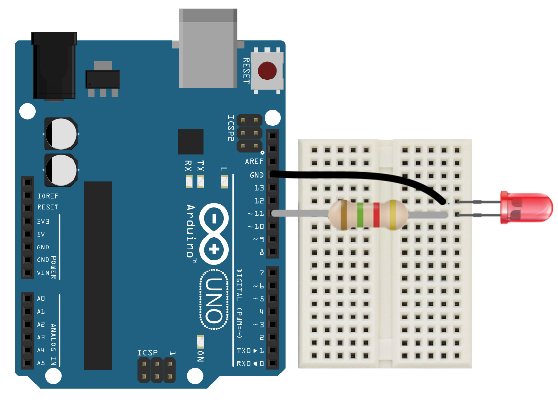
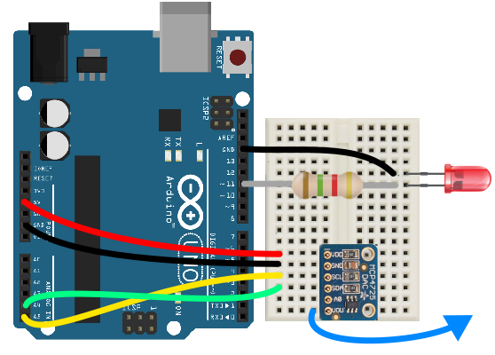

# SignalBuddy

`SignalBuddy` is an easy-to-make, easy-to-use signal generator for scientific applications. Making friends is hard, but making `SignalBuddy` is easy. All you need is an Arduino Uno! `SignalBuddy` replaces more complicated and (much) more expensive signal generators in laboratory settings where one millisecond resolution is sufficient. `SignalBuddy` can:

* generate **sin waves**, **step functions**, and **pulse trains**
* generate **DIGITAL** and **PWM** signals, in addition to **TRUE ANALOG** signals when used with the optional [MCP4725 Chip](https://www.adafruit.com/product/935)  
* be controlled with an intuitive serial monitor interface
* look fabulous is an optional 3D printed enclosure

Here are recordings of signals generated by SignalBuddy:

## quick start
* Download this repository, open `SignalBuddy.ino` from the `SignalBuddy` folder, and [upload it to an Arduino Uno using the Arduino IDE](https://www.arduino.cc/en/main/howto).
* Open the Serial Monitor by clicking the button in the top right of the IDE (1). Make sure the line ending dropdown is set to 'Newline' (2) and the baud rate is set to 115200 (3).    
* Enter **a number** to change the preset, **s** to deliver a signal, and **m** to print the menu. Presets can be adjusted by entering the letters in parentheses. For example, enter **a** to change the amplitude, **p** to change the ramp up time, and **f** to change the frequency of the currently selected stimulus.
* The PWM / digital signal is delivered from **PIN 11**. To visualize the signal, put a resistor (~100 ohm) + LED between pin 11 and ground. Connect the long leg of the LED to pin 11, and the short leg to ground: 

## true analog output
The amplitude of pin 11 output is modulated using [Pulse Width Modulation (PWM)](https://www.arduino.cc/en/tutorial/PWM) - basically, the output oscillates rapidly between 0 and 5 volts to approximate voltage between 0 and 5. `SignalBuddy` can generate true analog output when used with the [MCP4725 Chip](https://www.adafruit.com/product/935). Simply wire things up like this: 

Now the **VOUT** pin outputs an analog version of the signal. Notice that the PWM output can be used simultaneously. In my experiments I use pin 11 to drive a reference LED that is captured in a video feed, while the analog output drives a laser for optogenetics experiments.

## external triggering
Signals can be triggered by an external TTL input (a 5V pulse) to **PIN 2**. Simply change the `externalTrigger` parameter in `config.h` to `true` and re-upload the script. Now the currently selected preset will be delivered when the input on pin 2 changes from 0 to 5 volts.

## custom presets
You can adjust / add up to 9 presets by modifying `config.h` and re-uploading the script. Your new presets will appear when you re-open the Serial Monitor.

## project box
You can 3D print a custom `SignalBuddy` enclosure using the .stl files in the `enclosure` folder (see 3D animation above). The box is easily mountable, has a snap fit design for both the Arduino and the lid (no screws necessary!), and has convenient BNC ports. More details are available on the [SignalBuddy hackaday page](https://hackaday.io/project/167649-signalbuddy). Here is `SignalBuddy` making friends with Lindsey Buckingham:

## how the code works
There are a few neat tricks that make the signals accurate and the interface easy to use:

* [Timer interrupts](https://www.instructables.com/id/Arduino-Timer-Interrupts/) are at the heart of the code. The idea is this: Arduino Unos have 3 timers that can trigger blocks of code at user-specified frequencies. `SignalBuddy` sets timer 0 to 1 kHz, which triggers code that updates the signal every 1 millisecond. Using timer interrupts can be a little tricky, because several common Arduino functions rely on interrupts. For example, different PWM pins rely on different timers. It was important in this code to pick an output pin (pin 11) with PWM functionality that doesn't depend on the timer that's used for signal generation (timer 0).

* Rather than doing trigonometry on the fly, I use a sine lookup table to generate sine waves. But a long sine table eats up a ton of memory! It turns out that Arduino uses two types of memory: SRAM and flash. By default, programs are uploaded to SRAM memory, which is quite small. You can use [PROGMEM](https://www.arduino.cc/reference/en/language/variables/utilities/progmem/) to store variables in flash with little cost in terms of access speed. Another great trick is to use [the F macro](https://forum.arduino.cc/index.php?topic=110307.0) to save text printed to the Serial port to flash, rather than saving all of that text (one byte per letter!) to SRAM.

* This is my first object oriented Arduino project. Taking an object oriented approach was a real organizational game changer. Now I can't imagine the code working any other way! Each user preset is an instance of a Preset class, which has attributes ('members' in C++ terminology) such as amplitude, frequency, etc. All the presets can be easily stored and accessed in an array. Awesome.
