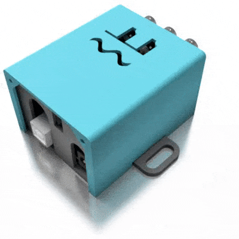
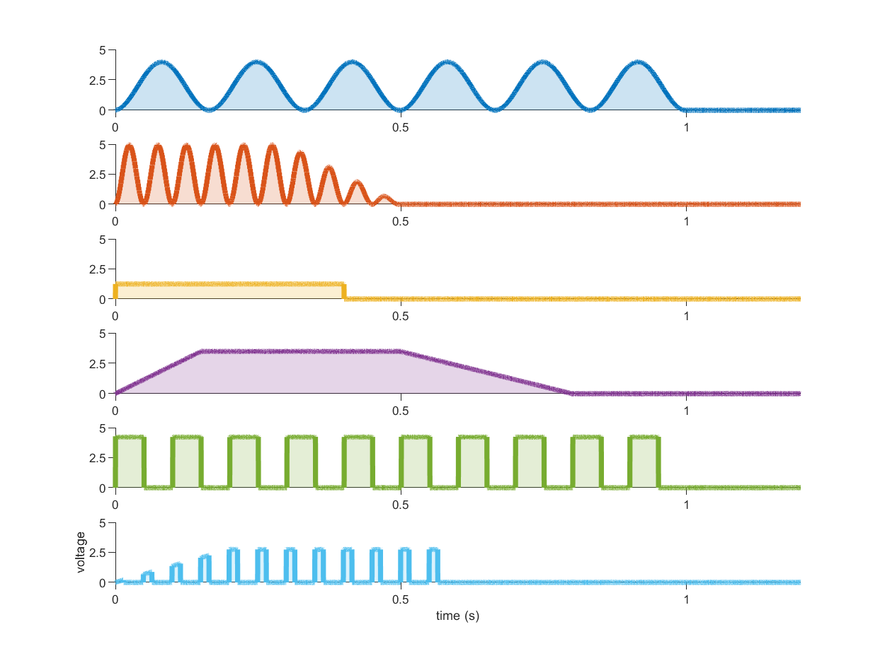
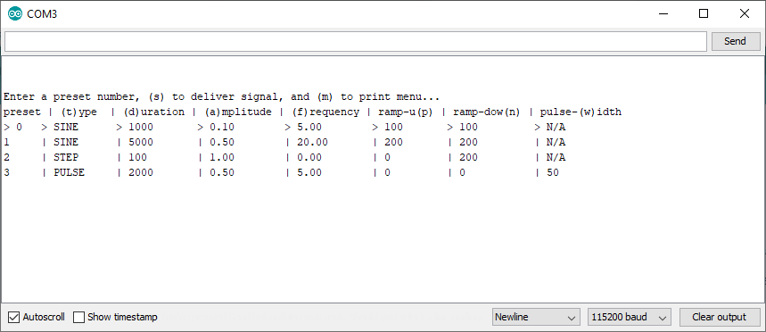

# SignalBuddy

`SignalBuddy` is an easy-to-make, easy-to-use signal generator for scientific applications. Making friends is hard, but making `SignalBuddy` is easy - all you need is an Arduino Uno! Little to no soldering is required. `SignalBuddy` replaces more complicated and (much) more expensive signal generators in laboratory settings where one millisecond resolution is sufficient. `SignalBuddy` can:

* generate **sin waves**, **step functions**, and **pulse trains**
* generate **digital** and **PWM** signals, in addition to **true analog** signals when used with the optional [MCP4725 Chip](https://www.adafruit.com/product/935)  
* be controlled with an intuitive serial monitor interface
* look fabulous is a 3D printed enclosure

Here are some recordings of signals generated by SignalBuddy:

## quick start
Connect an LED + resistor to pin 11. Upload `SignalBuddy.ino` to the Arduino and open the Serial Monitor. Make sure the line ending dropdown is set to 'Newline', and that the baud rate is set to 115200.

Here is what the interface looks like:

Enter **a number** to change the preset, **s** to deliver a signal, and **m** to print the menu. Preset settings can be adjusted by entering the letter in parentheses in the column for the setting. For example, enter **a** to change the amplitude, and **p** the ramp up time for the currently selected stimulus.

## custom presets
Modify (or add to) the presets in `config.h` and you are good to go.

## true analog output
under construction

## project box
under construction

## how the code works
under construction
