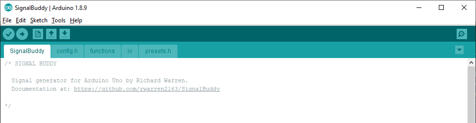

# SignalBuddy

`SignalBuddy` is an easy-to-make, easy-to-use signal generator for scientific applications. Making friends is hard, but making `SignalBuddy` is easy - all you need is an Arduino Uno! Little to no soldering is required. `SignalBuddy` replaces more complicated and (much) more expensive signal generators in laboratory settings where one millisecond resolution is sufficient. `SignalBuddy` can:

* generate **sin waves**, **step functions**, and **pulse trains**
* generate **DIGITAL** and **PWM** signals, in addition to **TRUE ANALOG** signals when used with the optional [MCP4725 Chip](https://www.adafruit.com/product/935)  
* be controlled with an intuitive serial monitor interface
* look fabulous is an optional 3D printed enclosure

Here are recordings of signals generated by SignalBuddy:

## quick start
* Download this repository, open `SignalBuddy.ino` in the `SignalBuddy` folder, and [upload it to an Arduino Uno using the Arduino IDE](https://www.arduino.cc/en/main/howto).
* Open the Serial Monitor by clicking the button in the top right of the IDE (1). Make sure the line ending dropdown is set to 'Newline' (2), and that the baud rate is set to 115200 (3).    
* Enter **a number** to change the preset, **s** to deliver a signal, and **m** to print the menu. Preset settings can be adjusted by entering the letters in parentheses. For example, enter **a** to change the amplitude, **p** to change the ramp up time, and **f** to change the frequency of the currently selected stimulus.
* The PWM / digital signal comes out of **PIN 11**. To visualize the signals, put a resistor (~100 ohm) + LED between pin 11 and ground. Connect the long leg of the LED to pin 11, and the short leg to ground: 

## custom presets
Modify (or add to) the presets in `config.h` and you are good to go.

## true analog output
under construction

## project box
under construction

## how the code works
under construction
